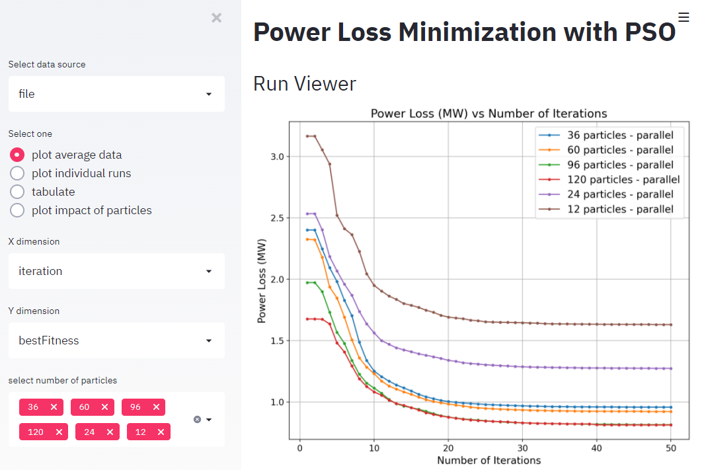
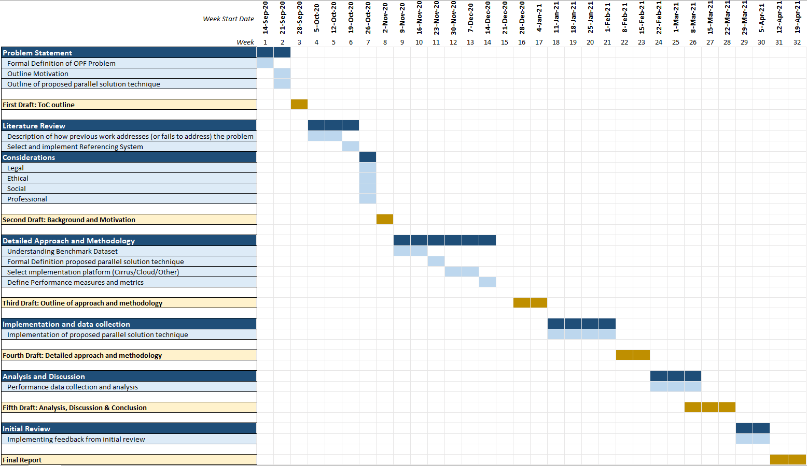

# Parallel-PSO-OPF-Scalability

>Note: All code snipets assume that the project's parent directory is the current active directory.

## Work Undertaken
In this MSc Dissertation project, we implemented a parallelized version of the PSO algorithm that was applied to a power loss minimization problem and executed on the [Cirrus Supercomputing System](https://www.cirrus.ac.uk/). We also explored how our implementation of the parallel PSO algorithm exploits the additional computational resources availed by the Cirrus system to minimize the computation time required to achieve an acceptable solution for the problem of minimizing power loss in the [IEEE 14 Bus benchmark power system](https://labs.ece.uw.edu/pstca/pf14/pg_tca14bus.htm) and [IEEE 30 Bus benchmark power system](https://labs.ece.uw.edu/pstca/pf30/pg_tca30bus.htm). 

#### Particle Swarm Optimization (PSO)
PSO is an evolutionary heuristic search algorithm that was first described by a social psychologist and an electrical engineer in 1995 to model the behavior of bird flock (Kennedy and Eberhart, 1995). The algorithm involves directly searching the problem hyperspace over several iterations using a population of candidate solutions that are referred to as “particles” to find an optimal solution.

#### Optimal Power Flow (OPF)
An electrical power system refers to the set of components involved in the generation, transmission, and distribution of electricity. Supplying electricity to the loads on an electrical power system typically entails satisfying several constraints (e.g., safety and physical operation constraints) and solving optimization problems like power loss minimization. Generally, the OPF problem involves choosing the set of control parameters of the power system that optimizes a given metric e.g., financial cost of electricity generation, power loss, emissions etc. or a set of metrics (multi-objective optimization).

#### Parallel Computing
Parallel computing refers to the use of multiple computing units to concurrently execute a program in contrast to executing the program on a single computer. Therefore, it follows that “parallelization” of an algorithm entails adapting the algorithm so that it can be executed concurrently using multiple computing units instead of a single computer. One of the major reasons for parallelization is to speed up the execution of computer programs by utilizing additional computing resources. Modern HPC systems, such the Cirrus system that was used for this project, allow programs to be executed on hundreds of computing units.
Although parallelization of a computer program introduces additional complexity, the gains achieved from parallelizing some programs far outweigh the cost of handling the additional complexity; such programs are said to have high scalability. As a result, in addition to parallelization, we assessed the parallel scalability of the PSO algorithm in this project. 

## Installing Dependencies 
>> <code>pip install -f requirements.txt</code>

## Visualization of Results
As part of the project, a custom browser-based interactive viewer was implemented using [Streamlit](https://www.streamlit.io/) to facilitate analysis of experimetal data. The viewer can be started using the following command:
>> <code>streamlit run run_viewer.py</code>

Here is a snapshot of the viewer
> 

## Project Work Plan
> 
